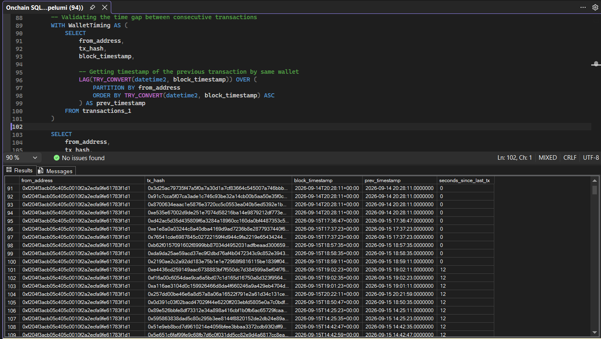
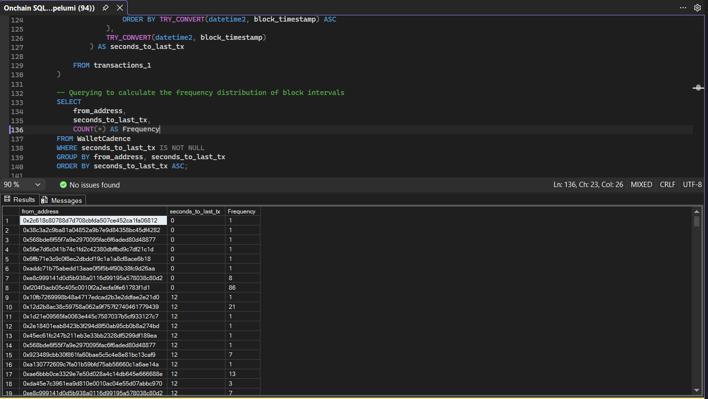
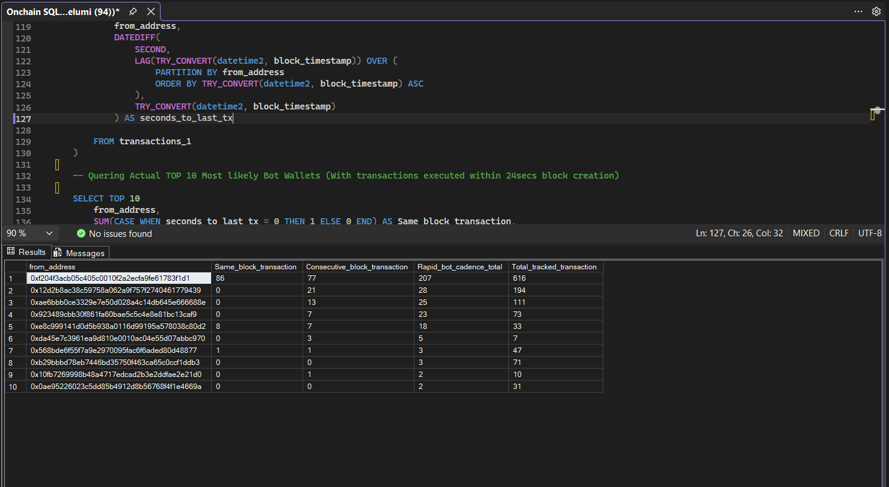
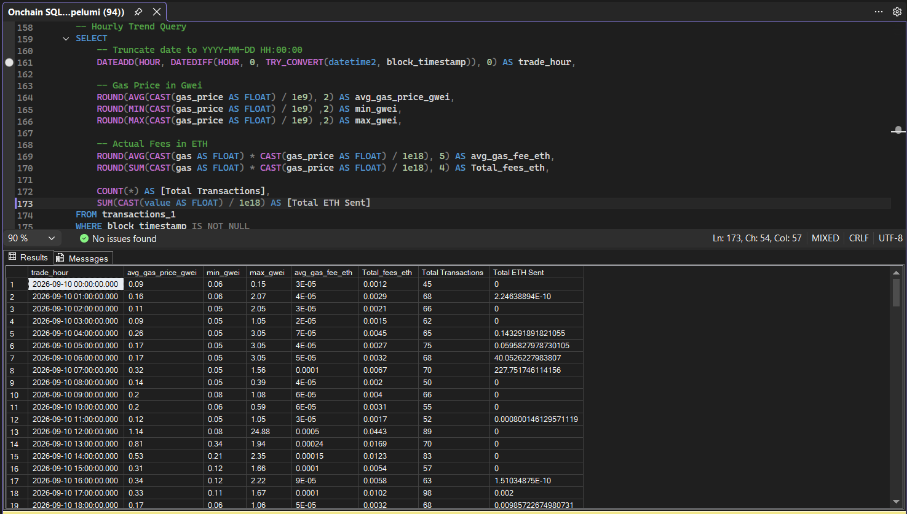
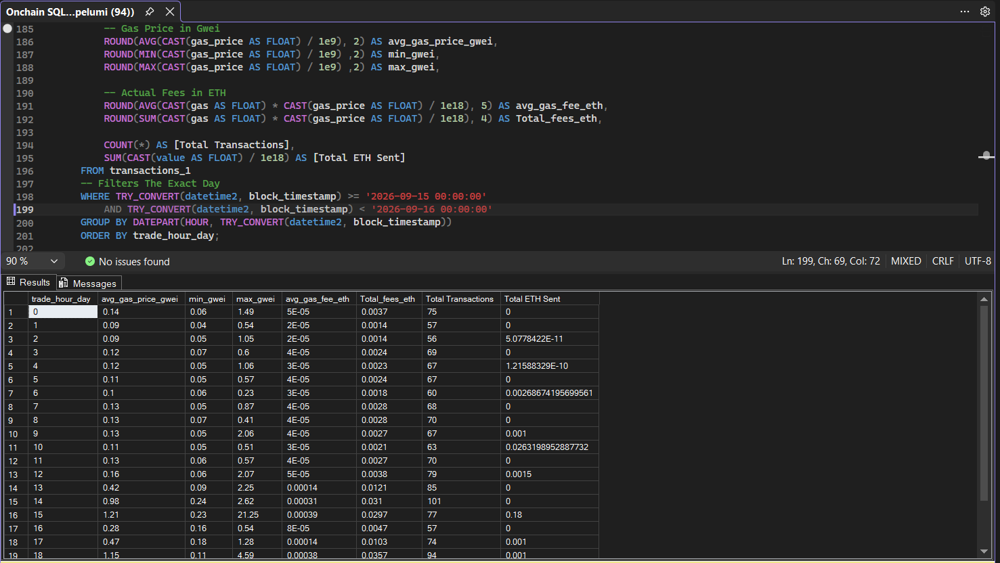
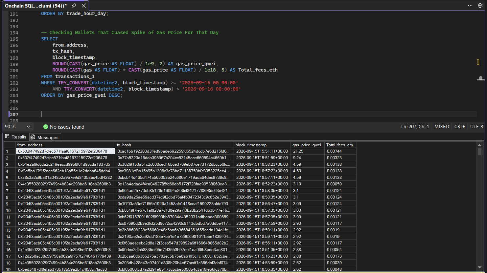
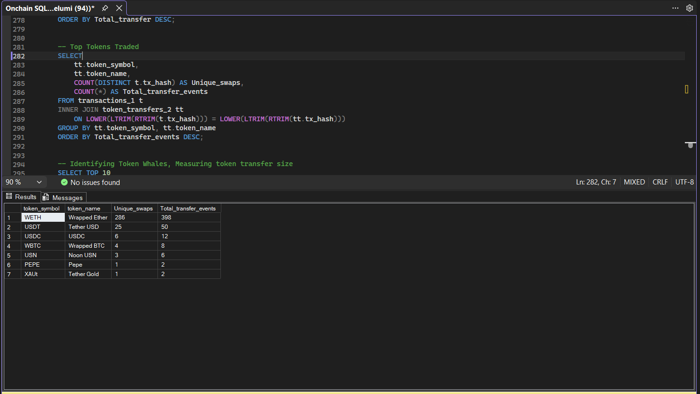
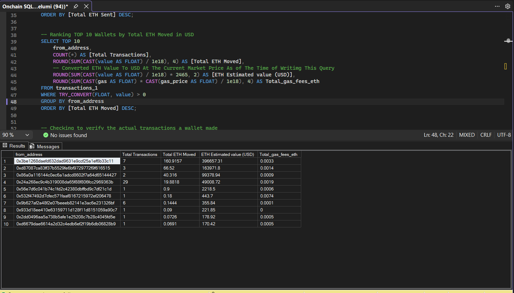
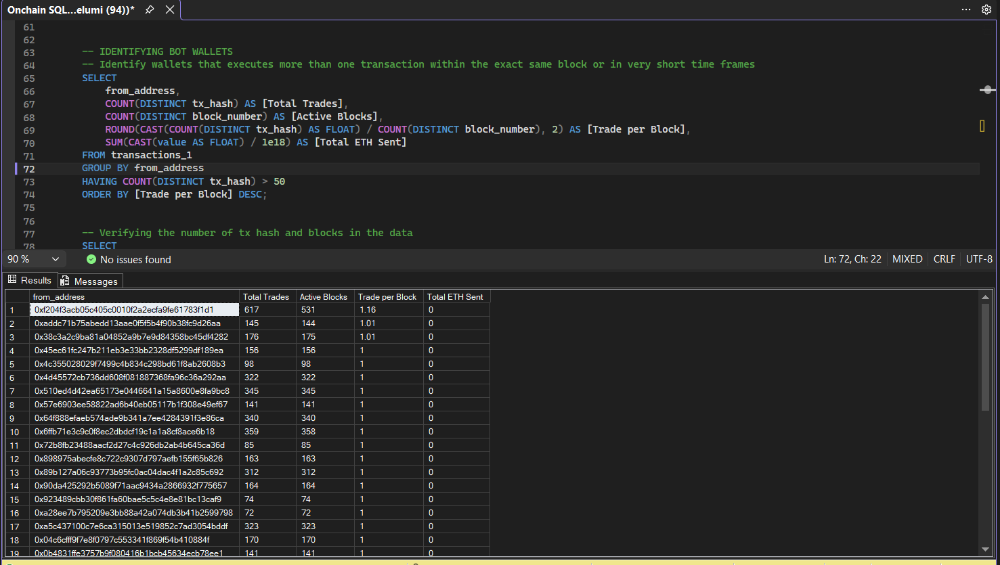

# Forensic On-Chain Analysis: Identifying Automated Trading Behaviour on Uniswap V3

An end-to-end blockchain analytics and data engineering project identifing wallets exhibiting behavioural patterns on the Uniswap V3 Router (`0xE592427A0AEce92De3Edee1F18E0157C05861564`) using Python, Etherscan V2 API, and Microsoft SQL Server (T-SQL).

---

## Executive Summary
By querying 10,000 router transactions and 6,364 ERC-20 token transfer events spanning Ethereum blocks `25,943,331` to `25,985,564`, this project isolates programmatic bot actors from manual retail traders. The analysis correlates **windowed temporal intervals**, **gas bidding dynamics**, and **relational token tracking** to profile algorithmic actors on-chain.

---

## Research Question:
Can transaction cadence, gas bidding behaviour and token-flow patterns be used to identify wallets exhibiting characteristics of automated trading activity on Uniswap V3? 

--- 

## Dataset
|  Attribute | Value |
| :--- | :--- |
| Network | Ethereum Mainnet |
| Protocol| Uniswap V3 |
| Router | 0xE5924...1564 |
| Transactions |10,000|
| ERC-20 Transfers| 6,364 |
| Block Range | 25,943,331 - 25,985,564 |
| Unique Wallets | 197 |
| Unique Assets| 31 |
| Source | Ethereum V2 API|

---

## Methodology
1. **Data Extraction**
    * Etherscan  V2 API
    * Router transactions
    * ERC-20 transfers
2. **Data Cleaning**
    * timestamp conversion
    * numeric conversion
    * whitespace/casing normalization
    * token decimal normalization
3. **Data Integration**
    * transaction hash used as relational key
4. **Behavioural Analysis**
    * transaction cadence
    * gas bidding
    * wallet activity
    * token flows
5. **Classification**
    * submitting transactions within same block
    * Elevated gas price
    * transactio with zero native ETH value

---

## Core Findings & Insights

### 1. The 12-Second Slot Rhythm (Bot Cadence Identification)
* **Proof-of-Stake Heartbeat:** Ethereum transactions inherit their parent block's 12-second slot timestamp, causing inter-transaction intervals to resolve in strict multiples of 12 (0s, 12s, 24s). 


* **High-Frequency Classification:** Screened wallets submitting transactions within $\le 24$ seconds across multi-trade sequences using window functions.


* **Likely Bots Flagged:** Wallets exhibiting repeated same-block and consecutive-block activity were flagged as candidates for automated trading behaviour.  `0xf204f3acb05c405c0010f2a2ecfa9fe61783f1d1` ranked highest among these candidates executing **207 rapid transactions**, featuring **86 atomic same-block executions (0 seconds)** and **77 consecutive-block trades (12 seconds)**.

 
### 2. Economic Forensics: Priority Gas Auctions (PGA)
* Hourly gas metrics revealed recurring **$10\times$ to $20\times$ divergences** between baseline gas prices (0.10–0.40 Gwei) and maximum bids (>21.00 Gwei).



* An intra-day query on 2026-09-15 isolated high-priority bidding activity during **18:50 and 18:59 UTC** window:
  * Competing automated wallets (`0x38c3a2...` and `0xf3e5ba...`) matched identical aggressive bids of **4.59 Gwei** just **12 Seconds (1 Block) apart** at 18:57:11 and 18:57:23 UTC.
  * Primary bot `0xf204f3...` executed rapid multi-tx burst within this cluster, including two simultaneous transactions at **18:57:35 UTC** (3.03 Gwei) and multiple trades at **18:59:11 UTC** (2.92 Gwei).
  

### 3. Capital Sizing & Asset Specialization
* **Liquidity Route Concentration:** WETH (Wrapped Ether) dominated router interactions with 286 unique swaps (398 transfer events), followed by stablecoins (USDT and USDC).


* **Whale vs. Bot Divergence:**
  * **Capital Whales:** The top native ETH mover (`0x3be1268...`) routed **160.9 ETH (~$396,657 USD)** across **7 transactions**, submitting standard baseline gas price (~0.33 Gwei).
  

  * **MEV Bots** routed transactions with zero native ETH value through ERC-20 pools, relying on repeated micro-margin swaps and paying elevated gas prices (2.9-4.6 Gwei) to ensure fast inclusion.
  

---

## Data Pipeline & Technical Challenges Overcome

| Challenge | Root Cause | Solution Implemented |
| :--- | :--- | :--- |
| **API Pagination Drift** | Initial token transfer extractions capped at 1,000 rows (Page 1 default), yielding only 42 cross-table matches. | Re-engineered the Python ingestion script to dynamically lock `startblock` and `endblock` boundaries matching the transaction table and looped pagination to capture all 6,364 emitted transfer events. |
| **Silent Join Failures** | Hex strings exported from CSVs had invisible trailing whitespace and casing discrepancies. | Implemented defensive string cleansing directly inside the relational join: `LOWER(LTRIM(RTRIM(t.tx_hash))) = LOWER(LTRIM(RTRIM(tt.tx_hash)))`. |
| **Cartesian Join Traps** | Joining on `block_number` produced 334 false-positive matches due to Many-to-Many block collisions. | Enforced strict `tx_hash` foreign-key linking to ensure only genuine parent router swaps were correlated with child token transfers. |
| **Multi-Decimal Scaling** | Distinct tokens use different native decimal precision (0, 6, 8, 9, 18), distorting volume sums. | Formulated dynamic exponential normalization using `POWER(10.0, CAST(token_decimal AS INT))` across all 31 unique assets. |

---

## Key SQL Logic: Identifying Rapid Wallet Activity
SQL window functions to calculate the time between consecutive transactions for each wallet, allowing wallets with repeated same-block or consective-block activity to be flagged for further investigation.
```sql
-- 1. Classifying Wallet Cadence via Window Functions
WITH WalletCadence AS (
    SELECT 
        from_address,
        DATEDIFF(
            SECOND, 
            LAG(TRY_CONVERT(datetime2, block_timestamp)) OVER (
                PARTITION BY from_address 
                ORDER BY TRY_CONVERT(datetime2, block_timestamp) ASC
            ),
            TRY_CONVERT(datetime2, block_timestamp)
        ) AS seconds_to_last_tx
    FROM transactions_1
)
SELECT TOP 10
    from_address,
    SUM(CASE WHEN seconds_to_last_tx = 0 THEN 1 ELSE 0 END) AS same_block_trades,
    SUM(CASE WHEN seconds_to_last_tx = 12 THEN 1 ELSE 0 END) AS consecutive_block_trades,
    SUM(CASE WHEN seconds_to_last_tx <= 24 THEN 1 ELSE 0 END) AS rapid_bot_cadence_total,
    COUNT(*) AS total_tracked_trades
FROM WalletCadence
WHERE seconds_to_last_tx IS NOT NULL
GROUP BY from_address
ORDER BY same_block_trades DESC, rapid_bot_cadence_total DESC;
```

---

## Limitations
* High-frequency transaction patterns are **indicators** not definite proofof bot activity.
* The analysis covers a defined block range rather than the entire Uniswap V3 history.
* Etherscan data may not expose every execution-level detail needed to conclusively attribute MEV strategies.
* Wallet-level behaviour does not neccessarily reveal the identify or intent of an underlying actor.

* Gas-price observations should be interpreted within Ethereum's fee-market mechanics.

---

## How to Run Locally
### Prerequisites
Before you running the project, make sure you have:
- Python 3.x
- Microsoft SQL Server

- SQL Server Management Studio (SSMS)
- An Etherscan API
### 1. Clone the repository:
   ```bash
   git clone https://github.com/Pelumite-codes/Etherscan_Data_Analysis.git

   cd Etherscan_Data_Analysis
   ```
### 2. Install Python dependencies:
Install the required Python packages:
   ```bash
   pip install requests pandas python-dotenv
   ```
### 3. Configure environment:
   Create a `.env` file in the root directory add your Etherscan API key:
   ```env
   ETHERSCAN_API_KEY="your_api_key_here"
   ```
### 4. Run Extraction Pipeline:
Run the Python Extraction script:
   ```bash
   python scripts/etherscan_data.py
   ```
The script queries the Etherscan V2 API and extracts:
   * Uniswap V3 router transactions

   * ERC-20 token transfer events

The resulting datasets are saved as:
   ```bash
   transactions_1.csv

   token_transfers_2.csv
   ``` 
**Note On Block Range:** The `startblock` and `endblock` parameters in the extraction script in the `download_token_transfers()` function are optional Etherscan V2 API parameters. They were explicitly specified in this project to constrain the ERC-20 transfer query to the same Ethereum block range used for the transaction dataset. This was important for maintaining dataset consistency and avoiding mismatches during the relational join between transaction and ERC-20 transfer data.
 
### 5. Load the Datasets into SQL Server:
Import the generated CSV files into Microsoft SQL Server:
* transactions_1.csv - Uniswap V3 router transaction data

* token_transfers_2.csv - ERC-20 token transfer data

Use the SQL import and export wizard in SSMS or anoter CSV-to-SQL import method.

Ensure both datasets are available as SQL tables before running analysis queries
### 6. Execute the SQL Analysis:
   Open `Onchain SQLQuery1.sql` inside SQL Server Management Studio (SSMS) and run the analytical suite.

---

The SQL queries generated the outputs used to identify wallets exhibiting behavioural characteristics consistent with automated tading activity.

These results should be interpreted alongside the projects limitations.
High frequency transactions patterns are **indicators** of automated behaviour, not definite proof of bot activity.